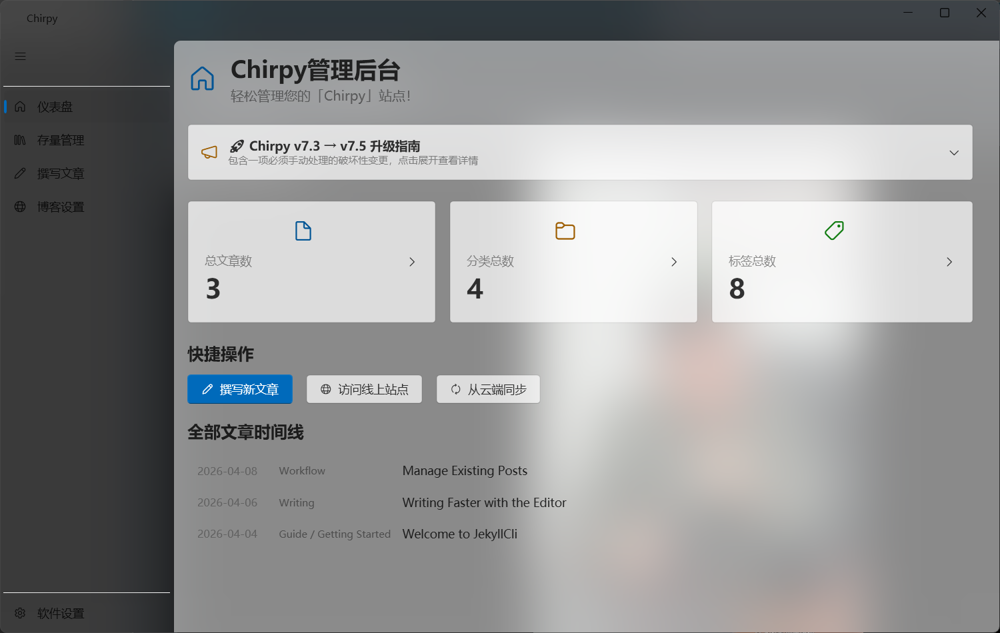
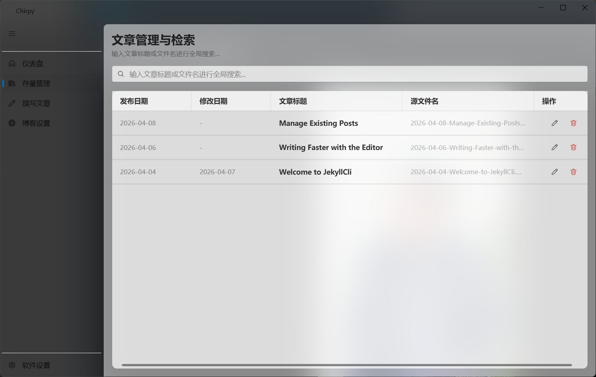
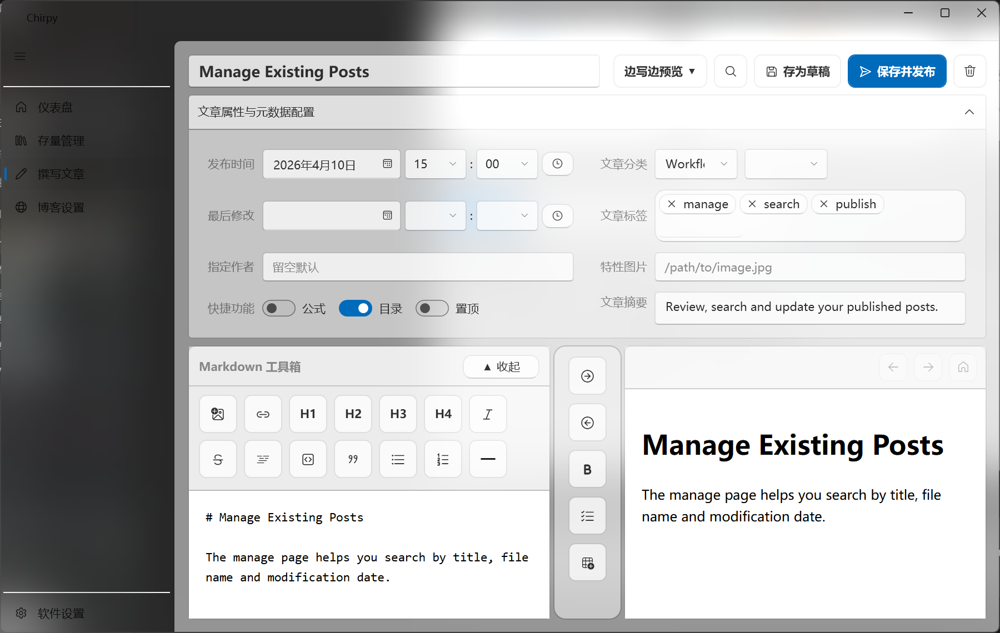
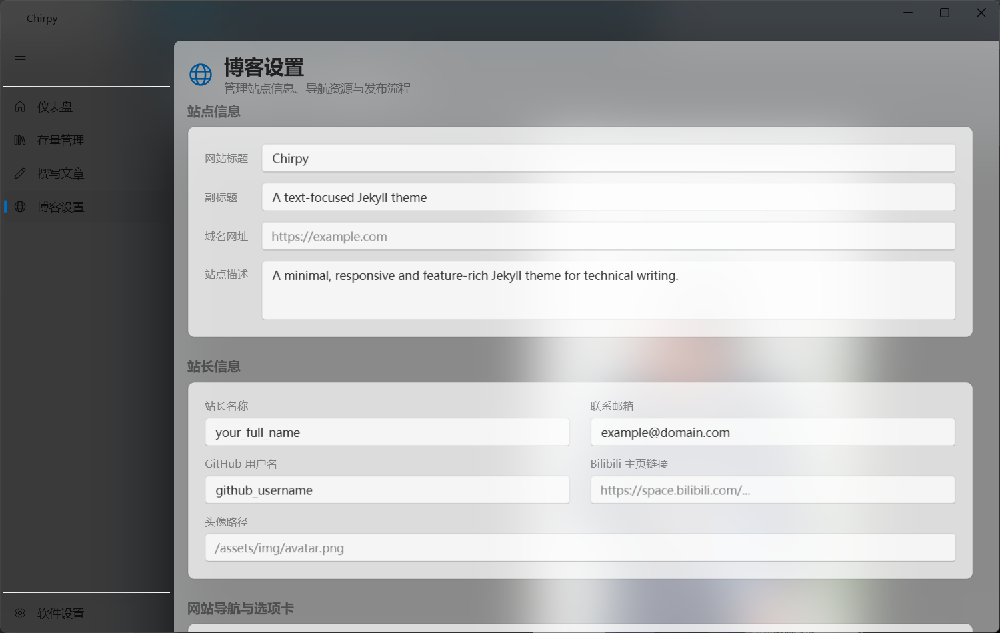
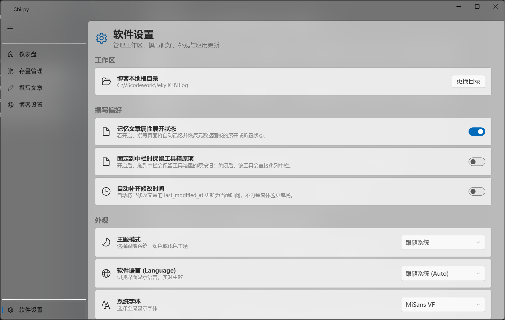

# JekyllCli 中文使用说明

简体中文 | [English](USER_GUIDE_EN.md) | [项目 README](../README.md) | [English README](README_EN.md)

这是一份面向最终用户的桌面端使用说明，适用于 [JekyllCli](https://github.com/Metahumanz/JekyllCli) Windows 版。文中的页面名称、按钮名称和操作流程，均以当前版本的实际界面为准。

## 1. 软件是做什么的

JekyllCli 是一款给 Jekyll 静态博客使用的 Windows 桌面管理工具，重点适配 Chirpy 主题博客。它把博客管理拆成 5 个主要页面：

- `仪表盘`：看文章、分类、标签统计和时间线。
- `存量管理`：集中检索、排序、编辑和删除文章。
- `撰写文章`：写 Markdown、看预览、维护文章元数据。
- `博客设置`：修改站点信息、作者资料、导航页和 Favicon。
- `软件设置`：切换工作区、主题、语言、字体、更新方式和写作偏好。

## 2. 使用前准备

建议在 Windows 环境下使用，并提前准备好下面几项：

- 安装 [.NET 10.0 Desktop Runtime](https://dotnet.microsoft.com/download)
- 安装 [Git](https://git-scm.com/)
- 如果要使用“发布”功能，请确保你的博客目录本身就是一个已经配置好远程仓库的 Git 仓库

下载包一般有两类：

- `bundle` 版：适合第一次搭博客，工具和模板一起打包。
- `minimal` 版：适合已经有博客目录的用户，包里主要是 `JekyllCli.exe`。

## 3. 第一次启动

第一次打开软件时，如果还没有绑定有效的博客目录，会自动弹出欢迎向导。

### 3.1 选择博客目录

你可以选择下面 3 种方式之一：

1. `选择已有博客目录 / 文件夹`
   直接选择包含 `_config.yml` 的 Jekyll 根目录。
2. `使用内置模板`
   如果你下载的是带模板的 `bundle` 包，可以直接绑定软件旁边自带的 `Blog` 目录。
3. `从 GitHub 拉取`
   软件会把官方 Chirpy 仓库克隆到你选择的父目录下，并默认创建 `JekyllBlog` 文件夹。

### 3.2 选择语言

当前向导支持在首次配置时选择软件语言：

- `中文 (zh-CN)`
- `English (en)`

如果选择中文，软件会同时把博客配置里的 `lang` 写成 `zh-CN`，并自动写入 `timezone: Asia/Shanghai`。

### 3.3 完成后会发生什么

- 软件会记住当前博客目录。
- 之后再次启动会直接进入主界面。
- 如果以后要换博客目录，可以在 `软件设置` 里重新切换。

## 4. 主界面速览

当前版本主界面左侧导航固定为：

- `仪表盘`
- `存量管理`
- `撰写文章`
- `博客设置`
- `软件设置`

如果你的博客 `title` 已经写入 `_config.yml`，窗口标题会自动显示站点名称。

## 5. 仪表盘

`仪表盘` 适合快速了解当前博客的整体情况。

你可以在这里完成这些操作：

- 查看文章总数、分类总数、标签总数
- 点击分类卡片或标签卡片，展开查看对应文章
- 浏览“全部文章时间线”，点击某篇文章后会直接进入编辑页
- 点击 `撰写新文章` 快速开始写作
- 点击 `访问线上站点` 打开博客网址
- 点击 `从云端同步` 执行一次 `git pull`

注意事项：

- “访问线上站点”依赖 `_config.yml` 里的 `url` 字段，如果没有填写会提示错误。
- “从云端同步”本质上是拉取远程 Git 更新，如果本地仓库状态异常，仍然需要你自己处理 Git 问题。

## 6. 存量管理

`存量管理` 页面适合批量找文章、改旧文章、清理历史内容。

它支持：

- 按标题或文件名搜索
- 按发布日期排序
- 按修改日期排序
- 按标题排序
- 按源文件名排序
- 双击行直接编辑文章
- 点击操作列中的按钮执行编辑或删除

删除说明：

- 删除操作会直接删除对应的 Markdown 文件
- 删除前会弹出确认框
- 删除后不会自动进入回收站，所以建议先确认文章是否已备份

## 7. 撰写文章

`撰写文章` 是软件的核心页面，适合新建文章和修改已有文章。

### 7.1 基本写作区

页面顶部可以完成这些动作：

- 输入文章标题
- 切换布局模式：`仅撰写` / `边写边预览` / `仅预览`
- `存为草稿`
- `保存并发布`
- `清空重置`

布局说明：

- `仅撰写`：只显示编辑区
- `边写边预览`：左侧编辑，右侧预览，中间有快捷工具栏
- `仅预览`：只显示预览区

在分栏模式下：

- 可以拖动中间竖栏调整编辑区和预览区宽度
- 拖到边缘时会自动切到单栏模式

### 7.2 文章元数据

点开 `文章属性与元数据配置` 后，可以编辑：

- 发布时间
- 一级分类和二级分类
- 最后修改时间
- 标签
- 指定作者
- 特性图片路径
- 公式开关
- 目录开关
- 置顶开关
- 摘要

标签输入的小技巧：

- 按 `Enter` 会提交当前标签并退出输入
- 按 `Esc` 会放弃当前输入并退出
- 输入框为空时按 `Backspace`，会删除最后一个已有标签

### 7.3 Markdown 工具箱

编辑区上方自带可拖拽的 Markdown 工具箱，常用能力包括：

- 标题 `H1` 到 `H4`
- 加粗、斜体、删除线、行内代码
- 代码块、引用、分隔线
- 无序列表、有序列表、任务列表
- 插入链接
- 插入表格
- 插入图片

工具箱支持：

- 折叠和展开
- 拖动调整工具顺序
- 把工具拖到中间竖栏固定

在 `软件设置` 中，还可以控制“固定到中栏时是否保留工具箱原按钮”。

### 7.4 链接与图片

插入链接时，软件会弹出对话框，要求填写：

- 显示内容
- 链接地址
- 是否在新标签页打开

插入图片时有两个前提：

- 文章标题不能为空
- 你需要选择本地图片，或者直接把图片粘贴到编辑区

图片处理规则：

- 软件会按文章标题生成目录名
- 图片会保存到 `assets/img/inposts/<文章标题转写目录>/`
- 若文件重名，会自动追加编号，避免覆盖
- 插入后会自动写入 Markdown 图片语法

除了文件选择，编辑器还支持：

- 从剪贴板直接粘贴图片
- 从剪贴板粘贴图片文件

### 7.5 保存与发布的区别

`存为草稿` 只做本地保存：

- 新文章会生成 `_posts/yyyy-MM-dd-标题.md`
- 已有文章会继续使用原文件名
- 保存成功后，顶部会显示本地保存成功提示

`保存并发布` 会在本地保存之后继续执行 Git 发布流程：

1. 先保存当前文章
2. 执行一次 `git pull`
3. 如果拉取没有冲突，再执行 `git add .`
4. 自动提交
5. 自动推送到远程仓库

如果 `git pull` 发生冲突：

- 软件会提示你先手动解决冲突
- 冲突解决后，再重新点击 `保存并发布`

补充说明：

- 软件保证的是“保存并推送到远程仓库”
- 推送后是否会自动构建和部署，取决于你的博客仓库是否已经配置好 GitHub Actions、GitHub Pages 或其他 CI/CD 流程

### 7.6 修改时间的处理

当你编辑的是已有文章时，如果内容发生变化但没有手动改“最后修改时间”，软件会根据设置做两种处理：

- 如果你在 `软件设置` 开启了“自动补齐修改时间”，软件会自动写入当前时间
- 如果没有开启，保存时会弹窗询问你是否更新 `last_modified_at`

### 7.7 离开前提醒

如果文章尚未保存：

- 切换页面时会弹出确认框
- 关闭软件时也会弹出确认框

这样可以避免误操作导致内容丢失。

## 8. 博客设置

`博客设置` 用来维护博客本身的内容，而不是软件外观。

### 8.1 站点信息

可以直接修改：

- 网站标题
- 副标题
- 域名网址
- 站点描述

### 8.2 作者与社交信息

可以维护：

- 站长名称
- 联系邮箱
- GitHub 用户名
- Bilibili 链接
- 头像路径

### 8.3 网站导航与选项卡

当前页面支持管理：

- `About`
- `Archives`
- `Categories`
- `Tags`

你可以修改：

- 标题
- 图标
- 排序
- `About` 页正文内容

这些内容会自动写回博客对应的 `_tabs/*.md` 文件和配置文件。

### 8.4 Favicon 图标导入

如果你使用的是较新的 Chirpy 版本，建议按当前页面提示重新生成 Favicon。

软件内已经提供两步操作：

1. 打开 `Real Favicon Generator`
2. 选择生成好的图标文件批量导入

导入时软件会自动把文件复制到：

- `assets/img/favicons`

并自动过滤：

- `site.webmanifest`

### 8.5 保存与发布

底部两个按钮的区别如下：

- `保存到本地`：只写入本地配置文件
- `保存并发布`：写入本地后自动提交并推送到远程仓库

适合的用法是：

- 小改动先本地保存
- 确认无误后再执行保存并发布

## 9. 软件设置

`软件设置` 管理的是工具本身的工作方式。

### 9.1 工作区

你可以在这里切换博客根目录。

要求很简单：

- 目标目录必须包含 `_config.yml`

切换成功后，软件会立刻重载当前博客上下文。

### 9.2 撰写偏好

这里有 3 个很实用的开关：

- `记忆文章属性展开状态`
- `固定到中栏时保留工具箱原项`
- `自动补齐修改时间`

如果你经常写长文，建议把“自动补齐修改时间”打开，体验会更顺手。

### 9.3 外观

可以调整：

- `跟随系统` / `深色` / `浅色` 主题模式
- 软件语言
- 全局字体

语言支持当前版本内置的中英文资源，字体则直接读取系统字体列表。

### 9.4 更新中心

这里可以：

- 手动检查更新
- 开启静默更新
- 跳转到 GitHub 项目页

更新机制说明：

- 软件启动后会自动延迟检查一次新版本
- 如果有新版本，可以直接在应用内下载
- 下载完成后可选择立即替换并重启
- 开启静默更新后，下载完成会直接应用更新

## 10. 推荐使用流程

### 10.1 第一次使用

1. 启动软件
2. 在欢迎向导中绑定博客目录
3. 到 `博客设置` 补齐站点标题、URL、作者信息
4. 回到 `撰写文章` 新建第一篇文章
5. 先点击 `存为草稿`
6. 确认无误后点击 `保存并发布`

### 10.2 修改旧文章

1. 打开 `存量管理`
2. 搜索标题或文件名
3. 双击文章进入编辑页
4. 修改正文或元数据
5. 保存或发布

### 10.3 更新站点配置

1. 打开 `博客设置`
2. 修改站点信息、About 页面或 Favicon
3. 先保存到本地检查效果
4. 确认后再保存并发布
5. 如果你已经用 JekyllCli 写好了文章，不知道怎么发布到网上，请参考这篇部署教程：[使用 Cloudflare Pages 免费托管你的 Jekyll 博客](https://pacil.dpdns.org/posts/Your-Blog-by-Cloudflare-Pages/)。

## 11. 常见问题

### 11.1 提示“目录无效，必须包含 _config.yml”

原因通常是你选择的不是 Jekyll 根目录。请重新选择包含 `_config.yml` 的那一级文件夹。

### 11.2 点击“访问线上站点”没有打开网页

请先在 `博客设置` 中补全 `域名网址`，软件读取的是 `_config.yml` 里的 `url`。

### 11.3 插入图片时提示要先填写标题

这是正常设计。因为软件需要根据文章标题创建图片目录，所以请先填写标题再插图。

### 11.4 发布失败

常见原因有：

- 本机没有安装 Git
- Git 远程权限没有配置好
- `git pull` 时出现冲突
- 当前博客目录并不是一个可正常推送的 Git 仓库

建议先在命令行里确认 `git status`、`git pull`、`git push` 是否可用，再回到软件里继续操作。

### 11.5 检查更新失败

更新功能依赖 GitHub Release 和网络环境。如果当前网络无法访问 GitHub，检查更新可能会失败，稍后重试即可。
